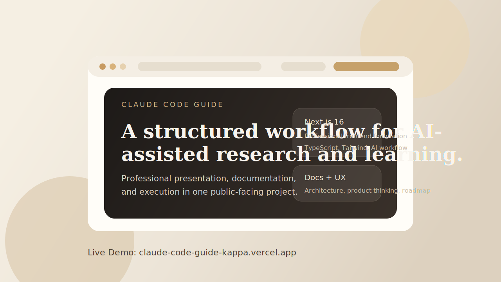

# Claude Code Guide

[](https://nextjs.org/)
[](https://react.dev/)
[](https://www.typescriptlang.org/)
[](LICENSE)

A professional Next.js project that turns Claude Code into a structured workflow for research, learning, and AI-assisted execution.

[Live Demo](https://claude-code-guide-kappa.vercel.app) · [Architecture](docs/architecture.md) · [Product Thinking](docs/product-thinking.md) · [Roadmap](docs/roadmap.md) · [Contributing](CONTRIBUTING.md)



## Overview

Claude Code Guide is a public-facing project about making AI-assisted work more legible and more useful.

Instead of treating Claude Code as a one-off coding assistant, this repository frames it as part of a broader system for resource curation, structured learning, content discovery, and practical experimentation. The project is designed to communicate not only technical skill, but also judgment: how AI workflows can be organized, documented, and presented professionally.

## Highlights

- Professional public presentation across the README, live site, metadata, and social sharing
- Structured information architecture separating interface, content, automation, and strategy notes
- Next.js 16 application with TypeScript and Tailwind CSS 4
- Documentation that explains the project as a system, not just a codebase
- Portfolio-ready framing for collaborators, recruiters, and stakeholders

## Live Demo

Visit the deployed site here:

- https://claude-code-guide-kappa.vercel.app

If you want correct production social metadata, set `NEXT_PUBLIC_SITE_URL` to your deployed domain in the hosting environment.

## What This Project Demonstrates

- AI workflow design grounded in repeatable structure
- Frontend implementation for a polished public interface
- Clear product thinking that connects technical choices to user value
- Documentation discipline that makes the codebase easier to understand quickly
- A stronger public signal for applied AI, research, and execution quality

## Repository Structure

```text
app/        App routes, layout, metadata, and homepage UI
public/     Static assets and README visuals
data/       Structured source material and content inputs
scripts/    Automation, scraping, and data-processing logic
docs/       Architecture, product thinking, and roadmap notes
.github/    GitHub workflows and repository automation
```

## Documentation

- [Architecture overview](docs/architecture.md)
- [Product thinking](docs/product-thinking.md)
- [Roadmap](docs/roadmap.md)
- [Changelog](CHANGELOG.md)

## Local Development

Install dependencies:

```bash
npm install
```

Run the development server:

```bash
npm run dev
```

Run type checks:

```bash
npm run typecheck
```

Create a production build:

```bash
npm run build
```

Run the full verification step:

```bash
npm run check
```

## Roadmap Priorities

- deepen the resource ingestion and update workflow
- improve discovery, filtering, and scanability for curated content
- add richer demo assets and screenshots for public sharing
- keep refining the repository as a strong public portfolio artifact

## Contributing

This project is currently maintained as a focused personal build, but suggestions and small improvements are welcome. Read [CONTRIBUTING.md](CONTRIBUTING.md) for guidance.

## License

This project is licensed under the [MIT License](LICENSE).
